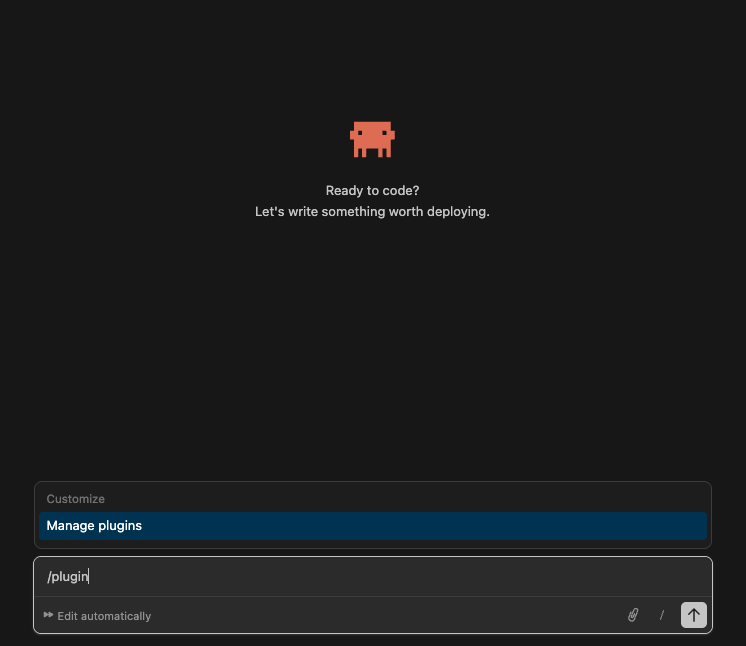
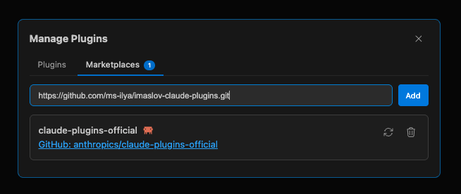
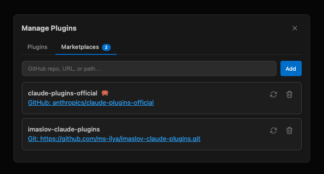
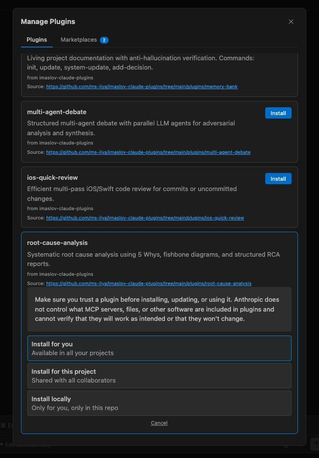
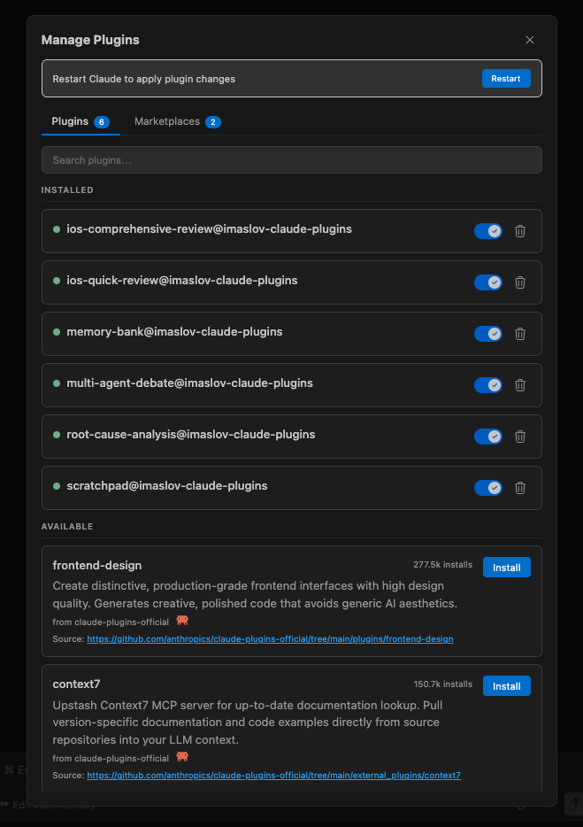

# imaslov-claude-plugins

Claude Code plugins by Ilya Maslau.

## Plugins

### iOS code review

Two plugins for reviewing iOS/Swift code. They differ in what they review and how they do it.

| Plugin | Reviews | Approach | Best for |
|--------|---------|----------|----------|
| [ios-quick-review](./plugins/ios-quick-review) | Uncommitted changes (default), commits, PRs | Single agent, 8 sequential phases | Work-in-progress code, small diffs, scope confirmation |
| [ios-comprehensive-review](./plugins/ios-comprehensive-review) | Committed branch/PR history only | 5 parallel agents, 4-stage pipeline | Large PRs, cross-file analysis, resumable reviews |

`ios-comprehensive-review` uses `git diff base...head` and only sees committed history. Uncommitted or staged changes are not included. To review uncommitted work, use `ios-quick-review` or commit first.

#### [ios-quick-review](./plugins/ios-quick-review)

Step-by-step code review that adjusts depth based on diff size.

- 8 phases: scope confirmation, then 7 review areas (correctness, architecture, naming, dead code, performance, side effects, AGENTS.md compliance)
- Adapts to diff size: small diffs get a quick combined pass; large diffs are split across parallel agents
- Confirms scope before starting deep analysis
- Searches the entire codebase to find every call site for each changed function or variable

**Skills:**

| Skill | Trigger |
|-------|---------|
| `/ios-quick-review` | "review my code", "review this commit", "check my changes", "find bugs" |

Auto-triggers only for Swift/iOS codebases.

**Requires:** Swift/iOS codebase. AGENTS.md in project root (optional, for naming/compliance checks)

---

#### [ios-comprehensive-review](./plugins/ios-comprehensive-review)

Multi-agent code review using 5 parallel agents across a 4-stage pipeline. Can resume if interrupted.

- Per-file analysis: unused code, force unwraps, memory leaks, threading, Swift Concurrency (`@Sendable`, actor isolation, continuations), naming
- Cross-file analysis: duplicate code, breaking API changes (including deleted functions), design violations with over-engineering check
- Test-aware: reports fewer warnings for test files
- Resumable: picks up where it left off if interrupted

**Commands and skills:**

| Skill | Trigger |
|-------|---------|
| `/review-all <PR number>` | "Review PR <number>", "Full iOS review for branch developer against main" |
| `/review-all --base <branch>` | Review current branch against base |

`/review-all` runs all 4 stages in one command with progress tracking.

Individual stage commands for debugging, partial re-runs, or splitting across sessions:

| Command | Stage |
|---------|-------|
| `/review-extract <PR number>` | 1. Extract diff and metadata |
| `/review-analyze` | 2. Per-file analysis (parallel agents) |
| `/review-cross-check` | 3. DRY, breaking changes, SOLID |
| `/review-report` | 4. Generate final report |
| `/review-cleanup` | Remove intermediate files, keep only report |

**Branch mode:** use `--base <branch>` in place of `<PR number>` in extract commands.

**Requires:** `jq`, `gh` CLI (PR mode), `git` (branch mode)

---

### Knowledge and context

Plugins for saving project knowledge and debugging notes so they persist across sessions.

#### [memory-bank](./plugins/memory-bank)

Documentation system that records the current state of a project, organized by feature. Every claim is checked against actual source code.

- Creates a structured `memory-bank/` folder with per-feature documentation
- Deep code analysis: architecture, data flow, key types, dependencies, tests
- Accuracy verification: every file path, type name, and behavior description is checked against real code
- Root-level docs: WIKI index, system patterns, tech context, troubleshooting

**Skills:**

| Skill | What it does |
|-------|--------------|
| `/init-memory-bank` | Scan project and create `memory-bank/` with root-level docs |
| `/update-memory-bank <feature>` | Deep-analyze and generate verified feature docs |
| `/update-memory-bank-system` | Refresh root-level docs (architecture, deps, WIKI index) |
| `/add-decision <feature>: <desc>` | Record a technical decision (ADR-style) |
| `/memory-bank` | Navigate the Memory Bank, route to the right sub-skill |

**Works with:** Any language (detects project type automatically; optimized for Swift/iOS)

---

#### [scratchpad](./plugins/scratchpad)

Debugging notebook that saves investigation notes across sessions.

- Creates `.scratchpads/` directory with one markdown file per issue (`SP-<issue-name>.md`)
- Tracks failed attempts, edge cases, related files, and design decisions
- On resolution, cleans up into a solution summary (moved to `resolved/`)
- Re-reads from disk on every call, so multiple concurrent sessions are safe
- Auto-shrinks at 150+ lines to keep AI context usage low

**Skills:**

| Skill | What it does |
|-------|--------------|
| `/scratchpad` | Create new, update existing, resolve, abandon, or switch scratchpads |

Intent is detected from natural language: "resolve", "abandon", "switch." No sub-commands to remember.

**Works with:** Any project

---

### Analysis and decision making

Plugins for in-depth analysis, challenging ideas from multiple angles, and finding root causes.

#### [multi-agent-debate](./plugins/multi-agent-debate)

Multi-agent debate that analyzes topics from genuinely different perspectives.

- Launches 3-5 independent agents that can only produce text (no file access, no commands)
- 10 built-in thinking styles give agents distinct personalities and reasoning patterns
- 3-round debate: Opening Positions, Cross-Examination, Rebuttals (or 2-round quick mode)
- If agents agree too early after Round 1, the panel is reshuffled to force real disagreement
- A neutral Judge delivers a verdict with direct quotes, confidence level, minority opinions, and conditions that would change the answer
- Post-debate options: go deeper, challenge the verdict, add a new agent, or export to markdown

**Skills and agents:**

| Component | Name | Trigger |
|-----------|------|---------|
| Skill | `/multi-agent-debate` | "debate", "red team", "devil's advocate", "analyze from all angles" |
| Agent | `debate-agent` | Spawned automatically by the skill for each participant |

**Works with:** Any topic; technical decisions, strategies, proposals, tradeoffs

---

#### [root-cause-analysis](./plugins/root-cause-analysis)

Finds the real cause of bugs and incidents using the 5 Whys method and structured reports.

- Guides investigation from observed symptom to actual root cause using the 5 Whys technique
- Groups contributing factors into categories: Code, Data, Infrastructure, Process, People
- 7-step process: gather facts, reproduce, identify factors, find root cause, propose solutions, implement, document
- Structured report with timeline, impact, solutions, prevention plan

**Skills:**

| Skill | What it does |
|-------|--------------|
| `/root-cause-analysis` | Guided analysis with 5 Whys, fishbone diagram, and RCA report |

**Works with:** Any project; production incidents, repeated bugs, performance issues, post-incident reviews

---

### Writing and editing

#### [humanizer](./plugins/humanizer)

AI-to-human text converter. 9-step pipeline: Content Intelligence, pattern detection, rewrite, two-pass self-audit, independent judge verification.

- 23 patterns in two priority tiers: tier 1 (8 patterns, ~80% of detectable AI tells) always fixed; tier 2 (15 patterns) fixed when present
- Statistical texture: information density variation, sentence length variance, referential cohesion, punctuation variety
- Adaptive voice: 12 content archetypes (blog, technical, email, marketing, academic, etc.) with mechanical voice parameter detection
- Two-pass self-audit: adversarial self-question + 14-point mechanical checklist
- Independent judge agent: for long text (>2000 words), a separate agent scores the rewrite without seeing the editing process
- Content integrity: never adds facts, claims, or opinions absent from the original; anti-hallucination guardrails block fabricated statistics and citations
- Era-aware vocabulary: AI word lists tagged by model generation (2023, 2024, 2025+) in `references/` for easy updates

**Skills and agents:**

| Component | Name | Trigger |
|-----------|------|---------|
| Skill | `/humanizer` | "humanize this", "de-slop", "sounds like AI", "too robotic", "reads like ChatGPT", "make it sound natural" |
| Agent | `judge` | Spawned automatically by the skill for long text verification |

**Works with:** Any text in any language; blog posts, documentation, emails, marketing copy, academic writing

---

## Installation

Works identically in the standalone terminal CLI and the VS Code / Cursor extension (Claude Code panel).

### Prerequisites

- **Terminal:** [Claude Code CLI](https://docs.anthropic.com/en/docs/claude-code) installed and authenticated
- **VS Code / Cursor:** [Claude Code extension](https://marketplace.visualstudio.com/items?itemName=anthropics.claude-code) installed and signed in

### Visual guide (VS Code / Cursor)

#### Step 1: Open plugin manager

Type `/plugin` in the Claude Code input field and select **Manage plugins**.

<p align="center">
  
</p>

#### Step 2: Add the marketplace

Switch to the **Marketplaces** tab. Paste the marketplace URL into the input field and click **Add**:

```
https://github.com/ms-ilya/imaslov-claude-plugins.git
```

<p align="center">
  
</p>

Once added, **imaslov-claude-plugins** appears alongside other marketplaces:

<p align="center">
  
</p>

#### Step 3: Install plugins

Switch to the **Plugins** tab. All available plugins from the marketplace are listed here. They are sorted by install count, so newly added marketplace plugins will likely appear at the bottom of the list. Scroll down or use the search box to find them.

Click **Install** on any plugin. You will be prompted to choose an installation scope:

- **Install for you** — available in all your projects (user scope)
- **Install for this project** — shared with collaborators via `.claude/settings.json` (project scope)
- **Install locally** — only for you, only in the current repo (local scope)

<p align="center">
  
</p>

#### Step 4: Enable, disable, and manage

After installation, all plugins appear in the **Plugins** tab with toggle switches. Enable or disable any plugin at any time without uninstalling it. A restart banner appears when changes need to take effect.

<p align="center">
  
</p>

### Terminal CLI commands

The same operations are available as CLI commands:

```bash
# Step 1: Add the marketplace
/plugin marketplace add ms-ilya/imaslov-claude-plugins

# If you've cloned this repo locally, you can add it by path instead:
/plugin marketplace add ~/downloads/imaslov-claude-plugins

# Step 2: Install a plugin (user scope — default)
/plugin install <plugin-name>@imaslov-claude-plugins

# Install to project scope (shared with team)
/plugin install <plugin-name>@imaslov-claude-plugins --scope project
```

**Available plugins:**

| Plugin name | Install command |
|-------------|----------------|
| `ios-quick-review` | `/plugin install ios-quick-review@imaslov-claude-plugins` |
| `ios-comprehensive-review` | `/plugin install ios-comprehensive-review@imaslov-claude-plugins` |
| `memory-bank` | `/plugin install memory-bank@imaslov-claude-plugins` |
| `scratchpad` | `/plugin install scratchpad@imaslov-claude-plugins` |
| `multi-agent-debate` | `/plugin install multi-agent-debate@imaslov-claude-plugins` |
| `root-cause-analysis` | `/plugin install root-cause-analysis@imaslov-claude-plugins` |
| `humanizer` | `/plugin install humanizer@imaslov-claude-plugins` |

### Managing plugins

```bash
# Open the interactive plugin manager
/plugin

# List marketplaces
/plugin marketplace list

# Disable a plugin without uninstalling
/plugin disable <plugin-name>@imaslov-claude-plugins

# Re-enable a disabled plugin
/plugin enable <plugin-name>@imaslov-claude-plugins

# Uninstall a plugin
/plugin uninstall <plugin-name>@imaslov-claude-plugins

# Update marketplace listings
/plugin marketplace update imaslov-claude-plugins

# Reload after changes
/reload-plugins
```

### Scopes

| Scope | File | Use case |
|-------|------|----------|
| `user` (default) | `~/.claude/settings.json` | Personal — all projects |
| `project` | `.claude/settings.json` | Team — shared via git |
| `local` | `.claude/settings.local.json` | Personal — this project only (gitignored) |

## License

[MIT](./LICENSE)
